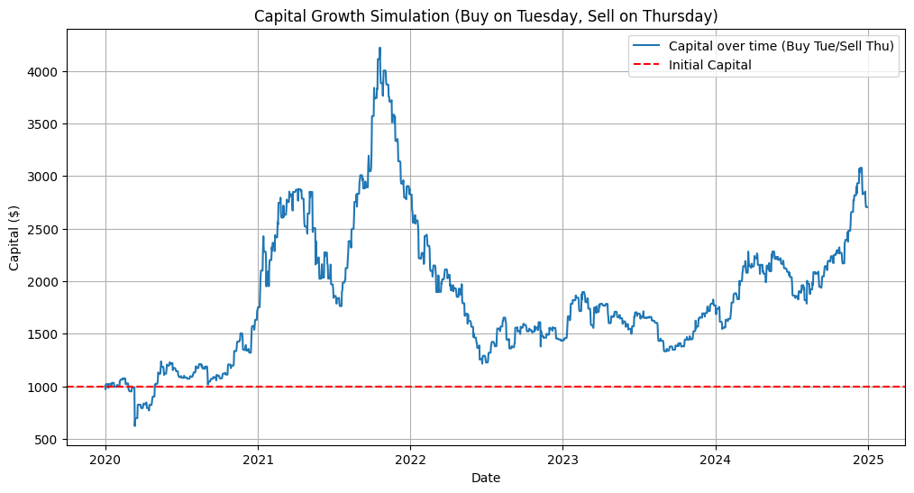

# Bitcoin-Trading-Strategy-Simulation

## Description
This script simulates a basic Bitcoin trading strategy using historical price data from 2020 to the end of 2024. The strategy involves buying BTC on Tuesdays and selling it on Thursdays.

## Features
- Downloads historical BTC-USD data with yfinance.

- Implements weekday-based strategy logic (Buy on Tuesday, Sell on Thursday).

- Tracks and visualizes capital growth over time.

- Evaluates all weekday combinations to find the most profitable buy/sell pair.

- Prints final capital and profit, and identifies optimal strategy.

## Purpose
Demonstrates how to use Python for financial backtesting, strategy simulation, and data visualization.

## Sample Output

```
Simulating Buy on Tuesday (Weekday 2) and Sell on Thursday (Weekday 4) strategy...

Final Capital (Buy Tue/Sell Thu): $1423.85
Total Profit/Loss: $423.85

Finding optimal buy and sell days...

Optimal Buy Day: Monday (Weekday 0)
Optimal Sell Day: Friday (Weekday 4)
Maximum Profit with Optimal Strategy: $1670.23
```





A line plot is also displayed, showing the evolution of capital over time with the strategy.
